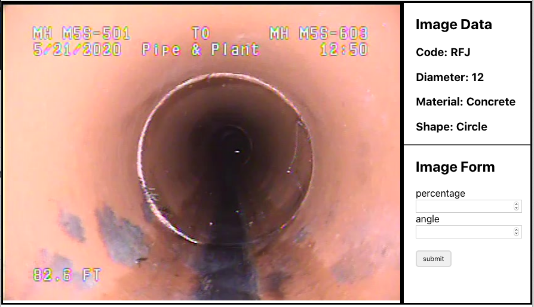

# Frontend Assessment Solution by Jason Toups



## Enginering Plan

I've been working with React Hooks, and I wanted to utilize them to handle state and update components.

## Components

In order to modularize the challenge, I created 4 separate [components](https://github.com/JasonToups/frontend-assignment/tree/master/src/components).

The **[DataLabelling](https://github.com/JasonToups/frontend-assignment/blob/master/src/components/DataLabelling.js)** component is the _parent component_ for the children listed below.
Then there are the Image _presentational components_ **[Image](https://github.com/JasonToups/frontend-assignment/blob/master/src/components/Image/Image.js)** and **[ImageData](https://github.com/JasonToups/frontend-assignment/blob/master/src/components/Image/ImageData.js)** to handle displaying the image and data.
The fourth child component is the **[ImageForm](https://github.com/JasonToups/frontend-assignment/blob/master/src/components/Form/ImageForm.js)**.

I utilized **usedState** in the Parent DataLabelling component, and on _form submission_ updated the renderImage State from the ImageForm child component to the parent component.

```javascript
const DataLabelling = () => {
  const { useState, useEffect } = React;
  const [results, setResults] = useState(null);
  const [renderImage, setRenderImage] = useState(null);

  // whenever renderImage updates in state, a new image is fetched
  useEffect(() => {
    getImage();
  }, [renderImage]);
```

## Handling Form

To render the forms after retrieving an image from the API, I used the provided JSON Schema to render the fields according to the code returned from the image get response, and to dynamically create the form validation.

I used [React Hook Form](https://react-hook-form.com/) to handle form validation and submission. It provided several handy methods { register, handleSubmit, reset } that made working with forms easier while writing less code.

Form fields are restricted to the min and max requirements stated in the schema.

```javascript
<input
  className='form-field'
  name={name}
  type={formFields[name].type}
  min={formFields[name].minimum}
  max={formFields[name].maximum}
  minLength={formFields[name].min_length}
  maxLength={formFields[name].max_length}
  required={true}
  ref={register}
/>
```

The form validation happens on the frontend, so the _form will not submit_ unless all of the validations pass.

If the _form validation passes_, then the onSubmit function is invoked, which does several things:

```javascript
const onSubmit = data => {
  // makes POST request from API, if passes form validation
  updateImage(data);
  // sets the state for the parent component to fetch and render a new image
  setRenderImage(id);
  // renders new form fields
  renderedFields();
  // resets the form fields
  reset();
};
```

After I was done with my initial pass of the project, I made a [bug-fix](https://github.com/JasonToups/frontend-assignment/tree/bug-fixes) branch to cleanup my code and fix any of the console errors that I was receiving, and to test out my fixes before merging them into master.

## Running the Project

I forked my project from the SewerAI Frontend Assignment repo, so staring it should be the same. Just clone the repo, and run:

```
npm start
```

The project will run on [http://localhost:3000/](http://localhost:3000/)

To create a build run:

```
yarn build
```

To run the build from the build folder run:

```
yarn global add serve
serve -s build
```

The build will run on [http://localhost:5000](http://localhost:5000)

# SewerAI Frontend Assignment

Data labeling is a major component of any machine learning pipeline. At SewerAI, we have our own set of web based tools to allow our labeling team to easily and quickly annotate data.

For this task, you will be creating a data labeling UI component similar to one we had to build at SewerAI. The goal is to receive an image that needs labeling as JSON data from a REST endpoint. Your component must display the image as well as accompanying data, and provide entry fields for the users input. These fields depend on the type of image, as will be explained below. The component then must submit the entries back to the server.

### Specification

You will receive the URL for an API endpoint that has been setup to provide data. Each call to the endpoint returns a json object describing a single frame (image). This object contains a url pointing to an image, as well as some data about the frame. The format is as follows:

    {
        "id": String,
        "frame_url": String,
        "code": String,
        "pipe_parameters":{
            "material": String,
            "diameter": Float,
            "shape": String
        }
    }

The id field contains a string identifier to be used when submitting. The 'code' field contains a string which describes the type of defect in the frame. For example, `RFJ` stands for 'roots fine joint', and indicates that there are small roots growing between the joints of two pipes. Pipe parameters contains various fields that describe the pipe the frame came from.

Your component must get a frame object from the endpoint, and display its data to the user including the image, code, and pipe parameters. It then must have input fields to allow the user to input data about the frame. These fields vary depending on the code according to a schema json file provided in this repo [field_schema.json](field_schema.json).

The schema json has a key for each possible code. Each key points to an object of the following form:

    {
        "fields": {
            "field_name": {
                "type": (number,string),
                "minimum": number,
                "maximum": number,
                "max_length": integer
            }
        }
    }

Taking an example from the schema for the code `DAGS`:

    "DAGS": {
        "fields": {
            "percentage": {
                "type": "number",
                "minimum": 0,
                "maximum": 100
            },
            "remarks": {
                "type": "string",
                "max_length": 128
            }
        }
    }

This indicates that upon displaying a frame with code `DAGS`, the UI should display inputs for two fields: percentage and remaks. Percentage should only accept numbers between 0 and 100, and remarks should accept strings of length up to 128.

There should be a submit button the user can press once data entry is complete. If any entry fields are missing or incorrect, the UI should warn the user and not submit. Otherwise, the UI should submit the data, clear the form, and load the next frame from the API.

Data submission should be done using a `POST` request to the same endpoint as data retrieval plus the frame id. For example if the frame id is "asdd-343d-asdf", post the data to `https://API_URL/asdd-343d-asdf/`. The post body should be a json object in which every key/value is a field name and its entered data. Using the `DAGS` example above, a possible submission object would be:

    {
        "percentage": 65,
        "remarks": "This is really bad"
    }

The object should only contain fields required by the schema for the particular codes. Extra or missing fields will result in a server error upon posting. Invalid data (i.e. number fields outside their min/max range) will also result in an error.

A sample UI is mocked up below for reference, however feel free to design the layout anyway you like.


### Requirements for UI

1. UI retrieves data from endpoint and correctly displays image and data.
2. UI provides data entry fields as required by the code schema.
3. UI does not allow invalid data submission (missing or out of range fields)
4. UI submits user data to server in correct format and receives back status 200.

### Assignment Guidelines

- This assignment should take around two hours or less. There is no need for perfection, just meeting the basic requirements.
- Please create your component using a javascript framework such as React, Angular, Vue.JS, or any other of your choice. Feel free to use create-react-app, Next.js or any other fast app creator you like.
- If you are using react and would like to get going quickly, this repository was created using create-react-app. Just fork it and add your code in a new file in src. Mount your component in App.js to display it. Make sure to `yarn init` after cloning the repo. See [README_CREATE_REACT_APP](README_CREATE_REACT_APP.md)
- If you have any questions, please let us know at nrubinstein@sewerai.com

### Submission

- Code for assignment should be uploaded to a github repository, either a new one you create or a fork of this one. Share your respository with github user `noachr` when complete.
- Your repository should contain a running html file that demos your UI. If you use create-react-app or similar, you can just run `yarn build` to create a static app.
- Your repository should have a readme describing your solution, the source code file location of your component, and how to run your demo.
